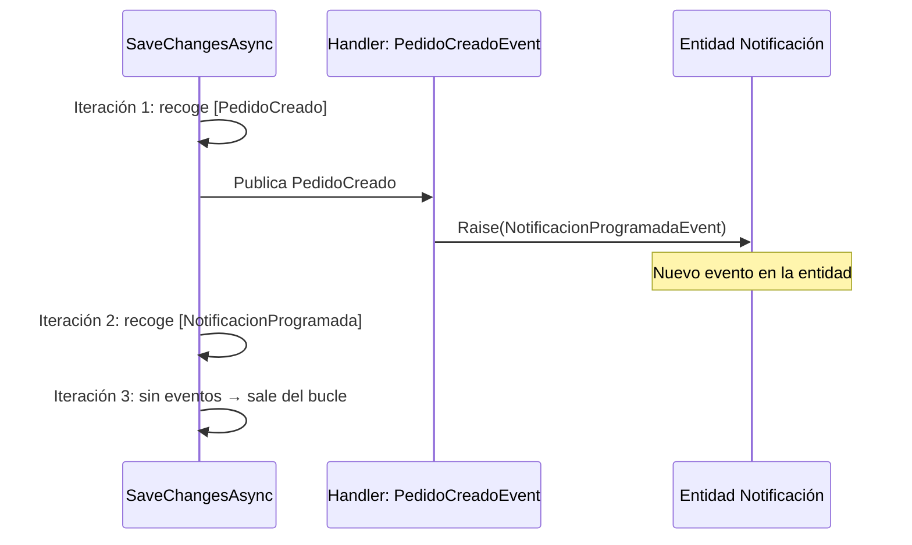

1. ¿Para qué es el bucle?
La primera iteración recoge los eventos que ya existían al hacer SaveChangesAsync(CancellationToken). Pero al publicarlos, un handler podría generar nuevos domain events sobre otras entidades ya trackeadas:

Sin el bucle, el evento NotificacionProgramadaEvent se perdería silenciosamente.
Dicho esto, si en tu plantilla los handlers de eventos nunca van a levantar nuevos eventos de dominio, un solo paso es suficiente y el bucle es innecesario. Es una decisión de diseño:
•	Sin bucle: más simple, suficiente para el 90% de los casos.
•	Con bucle: defensivo ante cascadas de eventos.
Tú decides según el nivel de complejidad que esperas en los proyectos que usen la plantilla.

2. ¿El ChangeTracker no se vacía tras base.SaveChangesAsync()?
No. Lo que cambia es el estado de las entidades, no su presencia en el tracker:
Antes de SaveChangesAsync(CancellationToken)	Después de SaveChangesAsync(CancellationToken)
EntityState.Added	→ EntityState.Unchanged
EntityState.Modified	→ EntityState.Unchanged
EntityState.Deleted	→ EntityState.Detached
EntityState.Unchanged	→ EntityState.Unchanged
Las entidades siguen trackeadas (salvo las eliminadas). Y la colección DomainEvents es una propiedad propia de Entity<TId>, no gestionada por EF Core, así que permanece intacta.
Por tanto, ChangeTracker.Entries<IHasDomainEvents>() sigue devolviendo las entidades con sus eventos después del SaveChangesAsync(CancellationToken). El código actual funciona correctamente en ese aspecto. ✅
---